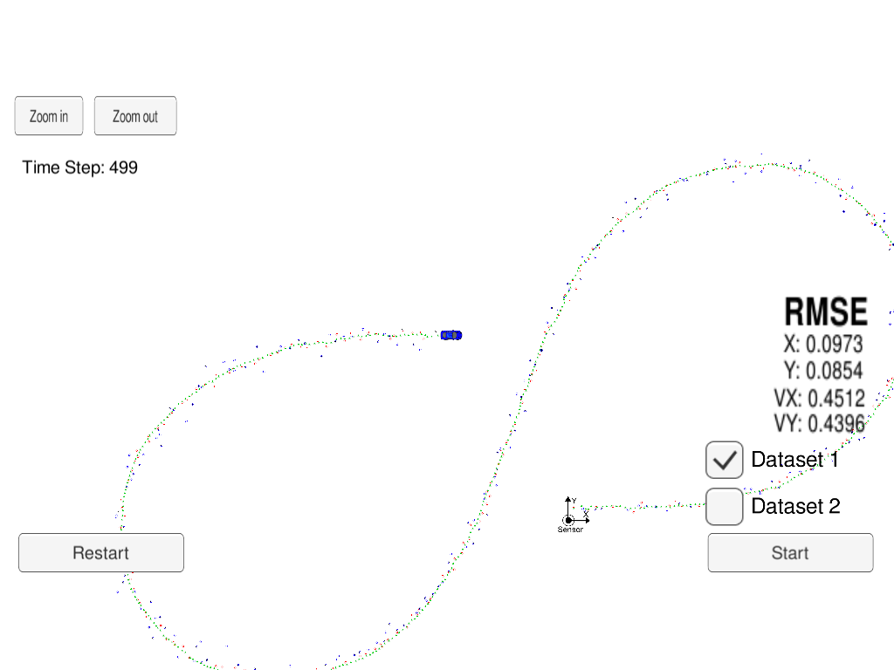
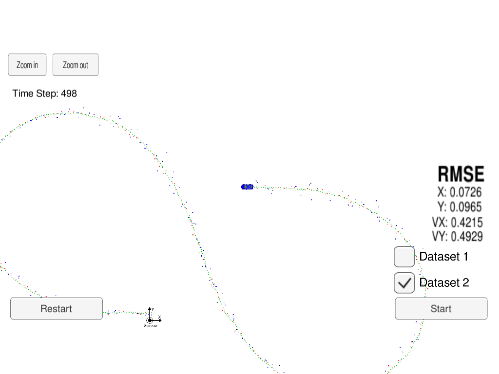

# Extended Kalman Filter

## About Kalman Filter

Kalman Filter (KF) is an algorithm to produce estimation of unknown variables using the system's dynamical model and multiple sequential measurements.

KF can be devided in two steps:
* Prediction for the new state for the unknown variable (e.g: position and velocity) and the error covariance matrix.
* Update of the state and error covariance matrix.

In this project, we are taking multiple readings from (simulated) laser and radar, and combine these measurements to produce state, which is more accurate than the laser and radar measurements.

Since both sensors use different coordinates (cartesian and polar) we need to implement an Extended KF (EKF) that takes into account the non-linearity associated with the polar coordinates (with respect to how we are storing the object's current state). For lidar we will use a linear system to project the data we are receiving, while we need a non-linear projection for radar information.

## Compiling and executing the project

- Clone the repo and cd to it on a Terminal.
- Create the build directory: `mkdir build`.
- `cd build`
- `cmake ..`
- `make`: This will create the executable `ExtendedKF`, that contains the EKF implementation.

`ExtendedKF` communicates with a Udacity simulator that reads the input data and produces estimations for the object. See [Udacity's seed project](https://github.com/udacity/CarND-Extended-Kalman-Filter-Project) for more information on how to install the simulator.

Open the simulator and run `./ExtendedKF` to enable the connection. Select Projects 1/2 from the simulator.

## Results

ExtendedKF combines the readings from Radar and Lidar information and estimates the current position of the object with small RMSE. The RMSE (x position, y position, x valocity, y velocity) for the two datasets I tried are:

- Dataset 1: 0.097, 0.085, 0.451, 0.439
- Dataset 2: 0.072, 0.096, 0.421, 0.492

## Code structure

The code is structured in 2 main classes:

- FusionEKF: contains the main logic that receives measuements, and decides whether to call a basic KF or an EKF depending on the type of measurement. This piece of code also handles the initialization of the different matrices used by KF to predict state and error covariance matrix.
- KalmanFilter: contains the different steps on a KF, Predict and Update. There are two types of Updates, one for KF and a second one for EKF that does the nonlinear transformation.

## Notes & next steps

I ran some other tests with the data provided, comparing the RMSE between using data from both Lidar and Radar, or only using one of the two sources. The results using Lidar data seem to be more precise for position, and there was almost no difference between using Lidar and Radar for the estimated valocities (at least not with the datasets I used). Since Lidar does not provide position data, I was expecting a better estimation of the velocities when using Radar.

Next steps for this project:

- Simulate other shapes, with more changes of direction, and check the performance (same with more and less noise on the simulated data).
- Get other sensor data and use the Kalman filter to estimate state of an object.
