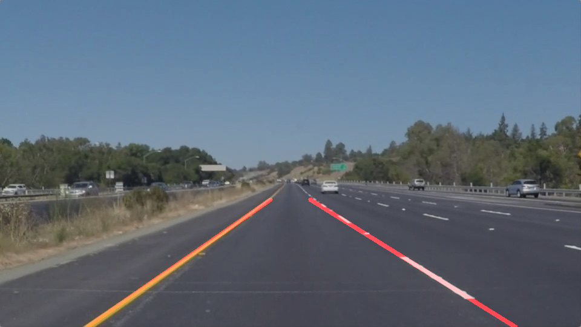

# Finding Lane Lines on the Road

The goals / steps of this project are the following:
* Make a pipeline that finds lane lines on the road
* Reflect on your work in a written report

### Reflection

### 1. Pipeline description

I implemented the pipeline in overlap_lane. This function takes one parameter, an image, and returns this image with extrapolated line segments that represent divisory lines on a road.

The steps taken in the pipeline are:

1. Transform the image to gray scale.
2. Blur the image using a gaussian kernel (smoothes the image, removing some high frequency noise).
3. Edge detection using canny.
4. Specify the region of interest (we ignore the rest of the image and create a binary image where the edges/lines are kept). This region of interest assumes that the car is always facing the same direction (in his lane, for instance) and that the camera is always in the same spot on the car.
5. Identify lines using Hough space, and print the lines in the image. 
6. Merge the original image with the image that contains the lines, and averages the result.

In the case of a video, every frame of the video is processed separately.

draw_lines(): To extend the lines instead of only representing the segments, I separated the lines in two groups: the ones that belong to the left line and the ones that belong to the right line. To do this, I computed the slope for each line (the assumption here is that all the lines detected during the Hough step belong to the road lines; in some cases this is not true and we need to remove this noise). If the slope was positive, the line was for the right side; if the slope was negative, it belonged to the left side.

This is a first step; a second step is, using the same dimensions than the ones used to specify the region of interest, we can remove some outliers from the training data we are using to fit a linear regression model. Another step we could take is to keep this regression parameters and limit the possible change between frames in a video to reduce noisy fluctuations on the lines drawn.

Some images from the final pipeline:

### 2. Shortcomings taken in this project

- The main shortcoming is the assumption that the lines are always on the same location of the image. We can probably create a more robust approach by allowing the limits of the region of interest to be changed, depending on the lines found using HoughLines. But if the car tries to change lanes, for example, the pipeline might fail detecting the lines on the image (at some moment should be a transtion of left->right or right->left in one of the lines).

- A second shortcoming is the number of outliers and false positives we find during the line detection. Removing them is not alsays trivial (I would use prior information to remove these outliers).

- Occlusion: if the lines are not visible, this method fails in predicting where the lines should be.

- Lighting: would this pipeline work out of the box if the videos were nocturnal?

- Other cars and some structures seem to confuse the line detector.

### 3. Future work

- Removing outliers is one of the main issues for this pipelines. By using the information that we are looking for a line, we can create a stonger cost function (different than the minimization of the sum of distances) that would ignore these points that are not close enough to the line, while at the same time maximizing the number of points that end up being close enought to the line. This change would belong to the definition of the region of interest for the next iteration, and to do the estimation of the slope of the lines (currently in the function draw_lines().

- Disallowing big changes on the regression result (we could do some integration over time to smooth the result).

### 4. Challenge

I did not have enough time to tackle the challenge fully, but I did some modifications to start addressing some of the issues that appear in this video; I will probably keep working on this and resend this piece later.

- The main change was to assign the region of interest proportional to the size of the images, instead of using a fixed #pixels. this still assumes that the car does not change lanes and that the camera is in the same position of the car, but it is a good start.

Most likely I would try to implement some of the suggestions to remove outliers (that cause the displayed lines to fluctuate into incorrect locations).
